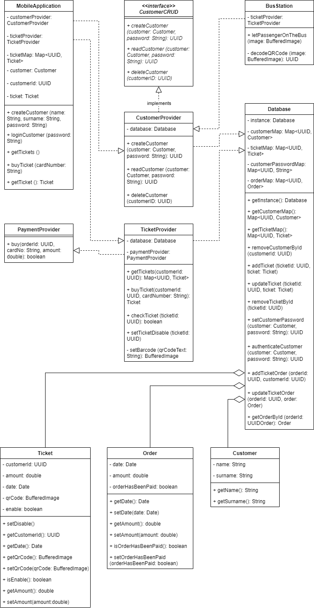

# softwareArchitecturePart4

## Диаграмма классов



## Описание

### main метод класса App

```java
public class App {
    public static void main(String[] args) {

        // Создаем экземпляр мобильного приложения
        MobileApplication mobileApplication = new MobileApplication();
        /*
                Создаем пользователя. Пользователь создается при помощи метода
                класса CustomerProvider, экземпляр класса Customer сохраняется 
                в базе Database. 
         */
        mobileApplication.createCustomer("Ivan", "Ivanov", "secretPassword");
        /*
                Покупаем билет. Покупка производится при помощи метода класса
                TicketProvider, при удачной покупке генерируется QR-код и в
                виде поля экземпляра клавва Ticket возвращается в mobileApplication
         */
        mobileApplication.buyTicket("323113123131");
        /*
                Вызываем QR-код из мобильного приложения
         */
        BufferedImage image = mobileApplication.getTicket().getQrCode();
        
        BusStation busStation = new BusStation();
        System.out.println("Ivanov wants to get on the bus");
        /*
                Предъявляем QR-код, получаем ответ
         */
        busStation.letPassengerOnTheBus(image);

        /*
                Создаем второе приложение, пытаемся пройти с уже 
                испльзованым QR-кодом            
         */
        MobileApplication mobileApplication1 = new MobileApplication();
        mobileApplication1.createCustomer("Pyotr", "Petrov", "qwerty");
        System.out.println("Petrov wants to get on the bus");
        busStation.letPassengerOnTheBus(image);

    }
}
```